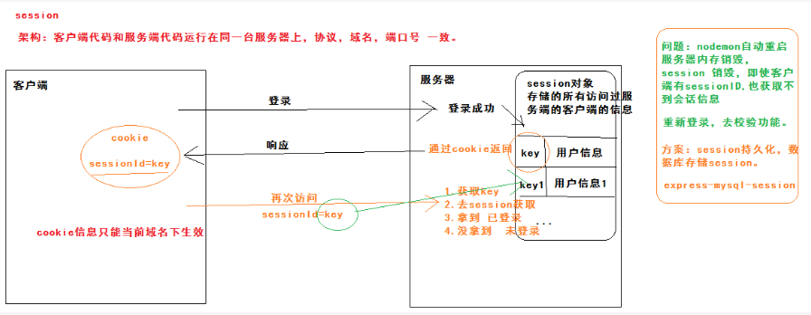
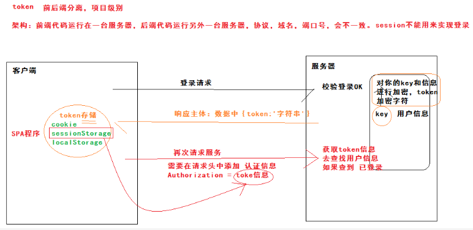
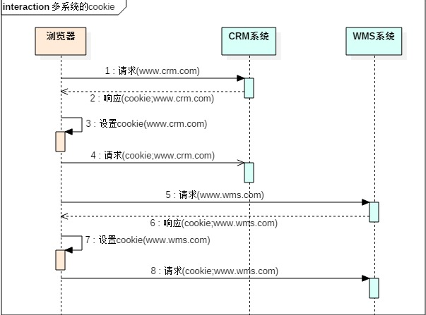
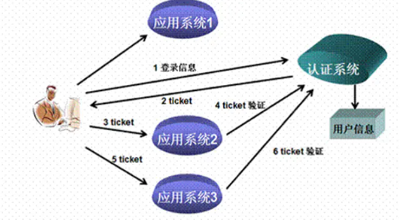

# 单点登录解决方案

# 前言---传统登录解决方案

## 基于cookie的登陆机制



#### session-cookie搭配形式存在诸多缺点：

- session是服务端存储的一个对象，主要用来存储所有访问过该服务端的客户端的用户信息.服务端以sessionId-session的键值对形式保存在内存中，服务器重启时，  
内存内的用户信息会被销毁.通常的解决方案是将会话信息保存在数据库或redis中。
- session基于cookie，而cookie的数据只有4k，且只在当前域名下有效。  
所以session这种会话存储方式方式只适用于客户端代码和服务端代码运行在同一台服务器上（前后端项目协议、域名、端口号都一致，即在一个项目下）
- 在分布式服务部署环境下，同一服务可有不同服务器上的后台提供，如果session未共享，当第一次请求服务在服务器A上登录，第二次请求服务路由到服务器B上时拿不到先前的登陆session 

## 基于token的登陆机制



#### token-localStorage搭配形式特点：

- 用于前后端分离项目，token是用户信息进行加密后的加密字符，原则上服务端不需保存。客户端通过cookie、sessionStorage、localStorage都可以进行存储。  
客户端请求不会默认携带，需要在请求头中认证字段Authorization携带token信息，服务器端就可以通过token信息查找用户登录状态。
- token-localStorage搭配时，localStorage大小5M左右
- 通常后端采用redis存储用户登录后的token

## 传统登录下的多系统系统



> 多系统登陆下访问系统A需要登陆，访问系统B需要登陆，使得多系统下用户访问体验很差。因此我们需要单点登录。

# 单点登录---介绍

## 要实现SSO，需要以下主要的功能：

> 所有应用系统共享一个身份认证系统（Server）：统一的认证系统是SSO的前提之一。
> 认证系统的主要功能是将用户的登录信息和用户信息库相比较，对用户进行登录认证；认证成功后，认证系统应该生成统一的认证标志（ticket），返还给用户。
> 另外，认证系统还应该对ticket进行效验，判断其有效性。

> 所有应用系统（Client）能够识别和提取ticket信息：要实现SSO的功能，让用户只登录一次，就必须让应用系统能够识别已经登录过的用户。
> 应用系统应该能对ticket进行识别和提取，通过与认证系统的通讯，能自动判断当前用户是否登录过，从而完成单点登录的功能。



## CAS流程：


> CAS Server 负责完成对用户的认证工作 , 需要独立部署 , CAS Server 会处理用户名 / 密码等凭证(Credentials)   
> CAS Client与受保护的客户端应用部署在一起，以 Filter 方式保护受保护的资源。负责处理对客户端受保护资源的访问请求，需要对请求方进行身份认证时，重定向到 CAS Server 进行认证  
> 业务系统需要向SSO服务器验证ST是否有效，以防SSO随便给业务系统一个ST，那么业务系统是不能确定这个ST是用户伪造的，还是真的有效，  
> 所以要拿着这个ST去SSO服务器再问一下，这个用户给我的ST是否有效，是有效的我才能让这个用户访问  

# 单点登录---实现

> 采用CAS构建单点登录
> [git地址](https://github.com/apereo/cas/tree/6.1.x)
> [文档地址](https://apereo.github.io/cas/5.2.x/protocol/CAS-Protocol.html)

> 单点登录-v1
> 利用CAS提供的cas-overlay-template构建
> [git地址](https://github.com/apereo/cas-overlay-template)
> [项目实现的单点登录服务端v1-git地址](https://github.com/SongOf/cas-v1)
> 该版本需要在tomcat上部署，优点：在win上或linux上同一tomcat压缩包（webapps下添加了cas.war的）

## CAS服务端---web端接入流程


> ①前端vue项目判断如果有token,则说明用户已登录，可以访问客户端A的服务。否则未登陆，未登陆有两种状态：在单点登录服务端已经登录和未在单点登录服务端登陆  
> 判断如果有ticket，则说明已在单点登录服务端登录。调用/cas/client/validateLogin接口验证该ticket是否有效。转②  
> 判断如果无ticket,则说明未在单点登录服务端登录。则定向到单点登录服务端。转③  
> ②/cas/client/validateLogin接口方法，发起http请求到单点登录服务端进行ticket验证，如果验证通过，则登录成功。单点登录客户端A生成token返回给前端，之后前端通过携带token访问客户端A的服务  
> ③单点登录服务端返回登录表单，用户输入用户名密码确定登录后，单点登录服务端调用用户信息验证端/auth/user/login接口，传递用户名密码参数，将验证委托给用户信息验证端  
> ④登录成功验证通过后，携带ticket返回浏览器，重定向地址如下:  
> https://links.jianshu.com/go?to=http%3A%2F%2Flocalhost%3A8000%2F%3Fticket%3DST-6-NqvtyjRhezstXiyyzNNN-C-DiTw-DESKTOP-CVVQ0QK  

**系统(后台-web)接入CAS需要的工作：**
> ①接入受保护后台系统，使其提供/cas/client/validateLogin接口，该接口功能如下：  
> 调用cas server的接口/p3/serviceValidate验证前端传递的ticket是否有效  
> 有效则cas server返回用户名，受保护后台取出用户信息验证用户有效后，生成token或sessionId-session返回给前端，前端下次访问受保护后台带上它们即可。  
> 无效则给前端错误信息  
> ②接入系统前端    

## CAS服务端---web端接入---受保护Client改造

### 增加cas-server-url 配置：

```
        #cas单点登录
        cas:
            prefixUrl: https://cas.ananops.com:9443/cas
```

### 实现/cas/client/validateLogin接口： 

> 参考代码所在包：com.iot.auth.cas
> CasClientController类：实现/cas/client/validateLogin接口
> CASServiceUtil类：封装接口/p3/serviceValidate
> XmlUtils类：解析cas,ST验证后的xml

## CAS服务端---web端接入---前端改造

### 增加cas-server-url 配置：

```
    <script>
      window._CONFIG = {};
      window._CONFIG['casPrefixUrl'] = 'https://10.112.196.254:9443/cas';
    </script>
```
### 导入sso.js封装，功能如下：
> ①判断localStorage是否含有token,若含有，说明局部回话已建立无需到cas server登录。  
> ②判断url中是否含有ticket,若含有，说明已经在cas server登录过，只是局部回话未建立。  
> 接着判断ticket是否有效,若有效，后台会建立局部会话并返回token,前端保存token用于接下来的接口访问。  
> 若无效，跳转到cas server登录界面。  

### 改造原有login action，替换为如下：

```javascript
ValidateLogin({ commit }, userInfo) {
      return new Promise((resolve, reject) => {
        getAction("/auth/cas/client/validateLogin",userInfo).then(response => {
          console.log("----cas 登录--------",response);
          if(response.msg==='success'){
            const result = response
            Vue.ls.set(ACCESS_TOKEN, result.token, 12 * 60 * 60 * 1000)
            commit('SET_TOKEN', result.token)
            resolve(response)
          }else{
            resolve(response)
          }
        }).catch(error => {
          reject(error)
        })
      })
}
```
> /auth/cas/client/validateLogin接口返回信息格式和内容视系统需要而定。

### 改造原有logout action，如下：

```javascript
Logout({ commit, state }) {
      return new Promise((resolve) => {
        let logoutToken = state.token;
        commit('SET_TOKEN', '')
        commit('SET_ROLES', [])
        commit('SET_INFO', {})
        Vue.ls.remove(ACCESS_TOKEN)
        //console.log('logoutToken: '+ logoutToken)
        logout(logoutToken).then(() => {
          var sevice = "http://"+window.location.host+"/";
          var serviceUrl = encodeURIComponent(sevice);
          window.location.href = window._CONFIG['casPrefixUrl']+"/logout?service="+serviceUrl;
          //resolve()
        }).catch(() => {
          resolve()
        })
      })
}
```
> 清除localStorage内容视系统需要而定。

# 单点登出---待完成