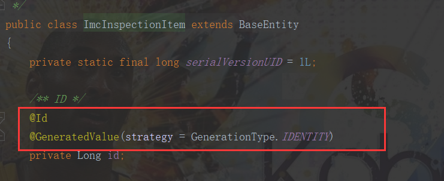

# ananops-gen

### 代码生成器使用
1. 把业务模块的表先导入ananops_cloud
2. 修改ananops-gen模块resource下generator.yml,把packageName改为自己模块的包路径,如 com.iot.amc
3. 运行前端生成代码
4. 把按钮SQl里的 parent_id 改为你自己模块菜单的id,执行按钮SQL(菜单的SQL不要执行,菜单已经创建好了)
5. 注意：生成的domain类中id的注解（下图）

6. 将原来的表单迁移时，注意修改字段：creater->create_by，created_time->create_time，last_operator->update_by，并增加remark字段