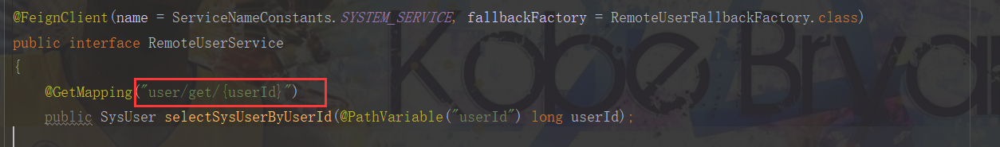
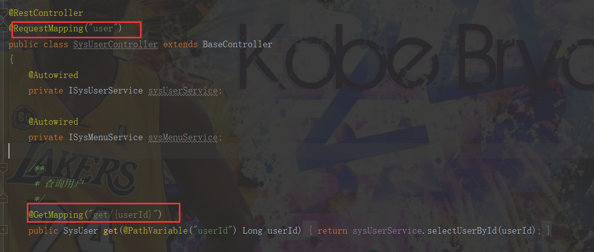

# ananops-xxx（业务模块的嵌入，以imc为例）

### 创建模块的配置文件
1. 在ananops-discovery的config目录下添加ananops-imc-dev.yml文件备份。
2. 将ananops-imc-dev.yml文件放到部署服务器的/home/ananops-cloud/ananops-config-repo目录下（本地部署需要修改ananops-discovery的bootstrap.yml中的search-locations）。

### 修改gateway配置文件
1. 在ananops-gateway-dev.yml的whiteList中添加“/imc/v2/api-docs”，从而避免获取swagger的请求被拦截。
2. 在ananops-gateway-dev.yml的routes下添加imc的路由。

### 创建ananops-xxx-api模块
1. 将ananops-imc的domain、dto放到该模块（这些实体类中部分可能需要在模块间进行交互，因此统一放到api模块）。
2. 注意feign交互方式与原系统的不同，模块中接口的url要与被调用模块（此处为ananops-imc模块）中接口的url对应一致（如下图）。

### 创建ananops-xxx模块
1. 在搭建好模块基本结构后，参考代码生成器的使用，将生成的业务代码添加到该模块即可。
2. 为前端服务的VO可以放在该模块。